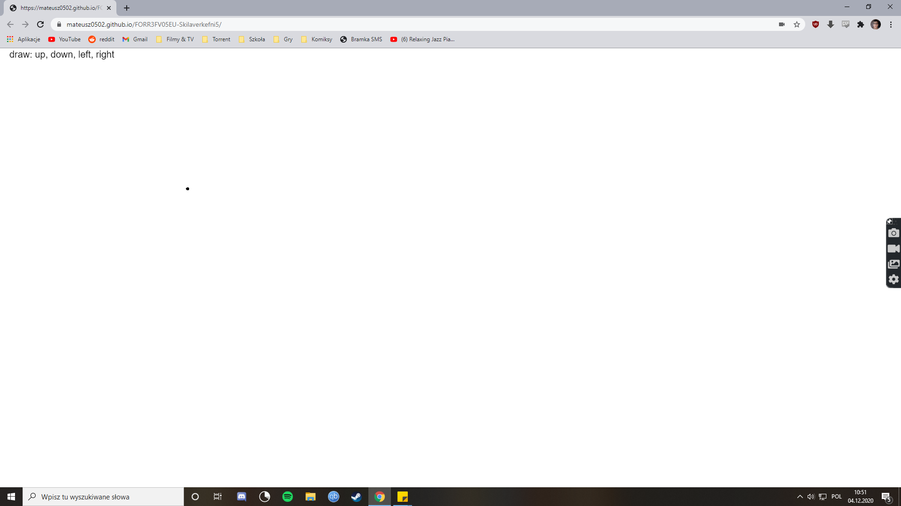
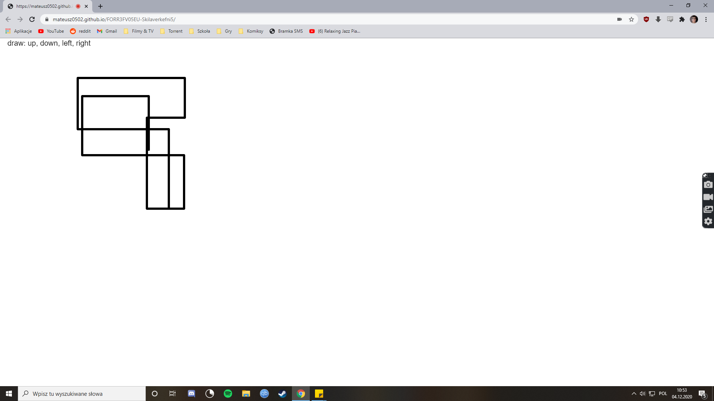

# Skilaverkefni 5
## Upplýsingar um höfund, áfanga og skóla
- Mateusz Kuzniewski
- FORR3FV05EU
- Tækniskólinn
- Haust 2020
## Verkefnalýsing
**Virtual "Etch-A-Sketch" stjórnað að raðskipunum**  
Notaðu röddina þína til að færa línu í 4 áttir og búa til einfaldar teikningar.
## Myndir og myndbönd

## Greinagerð
**15.11** - Bjó til index.html og style.css, byrjaði að vinna við javascript.  
**22.11** - Ákvað að nota p5.speech safnið, öllum kóðanum verður bætt við p5.speech.js skrána.
**04.12** - Búinn að skrifa kóðann. Allar Skrár eru settar í github til að prófa það.
## Útkoman, næsta skref
--//--
## Vefsiða
https://mateusz0502.github.io/FORR3FV05EU-Skilaverkefni5/
